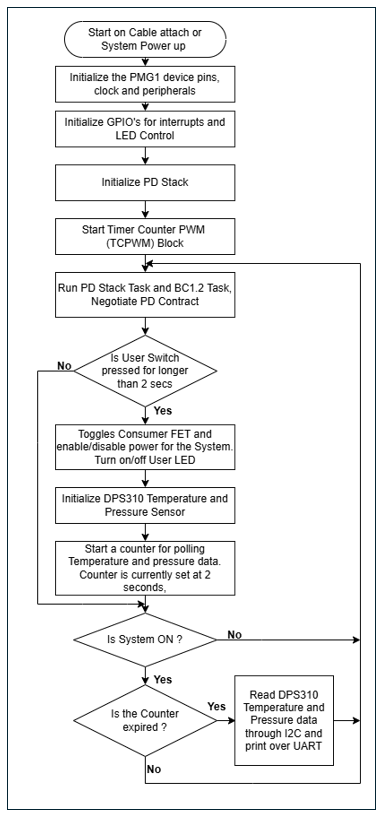
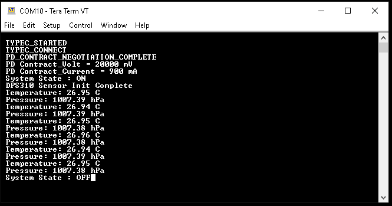
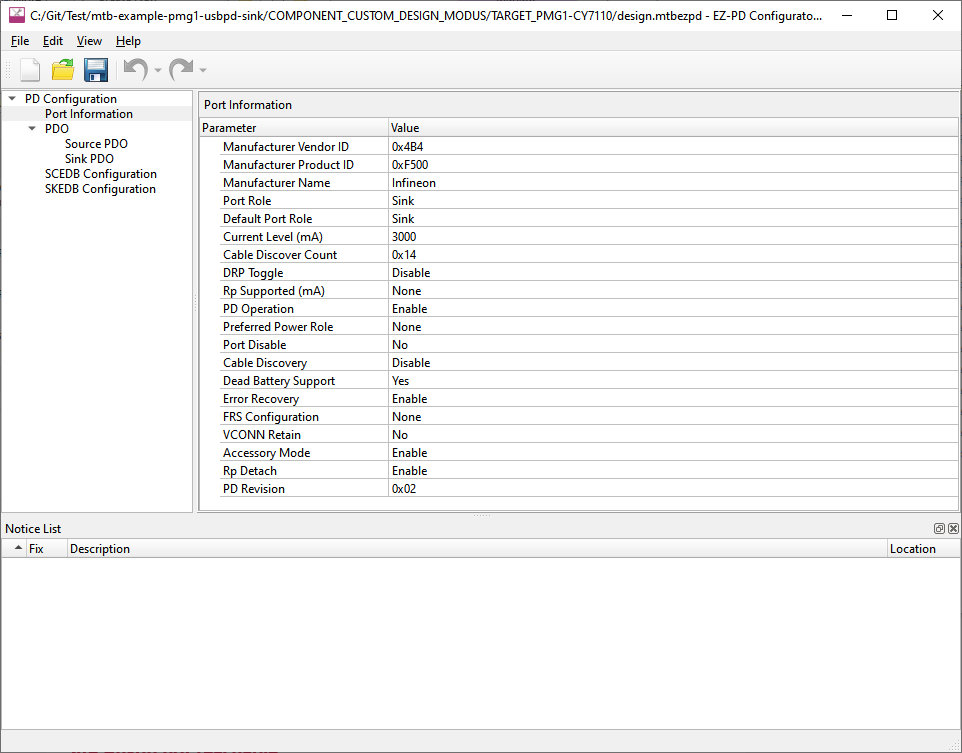
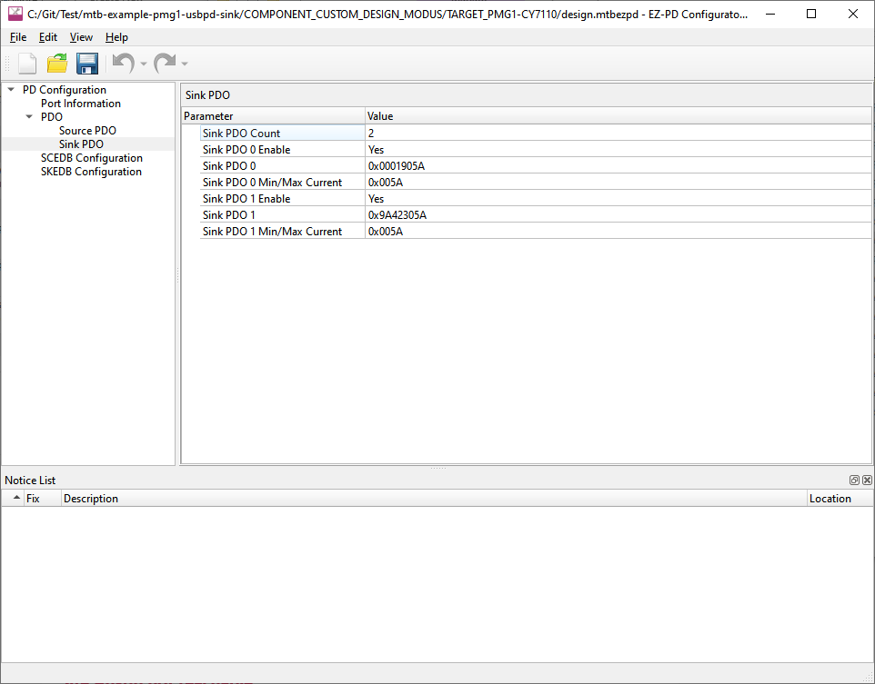

# EZ-PD&trade; PMG1 MCU: USBPD Sink DPS310 I2C Sensor

This code example demonstrates USB Type-C attach detection and PD contract negotiation using EZ-PD&trade; PMG1 MCU devices. The code also demonstrates how to integrate the DPS310 temperature and pressure sensor to PMG1 devices over the I2C interface.

The code uses the GPIO interrupt logic to detect button presses. Once the button is pressed and the system moves to ON state, the firmware turns ON the  Sink FET and user LED, and initializes the DPS310 sensor. The firmware then uses the TCPWM block in Timer/Counter mode to generate periodic interrupts to measures the sensor data. The measured temperature and pressure data are sent over UART to display on a terminal.

[View this README on GitHub.](https://github.com/Infineon/mtb-example-pmg1-usbpd-sink-dps310-i2c-sensor)

[Provide feedback on this code example.](https://cypress.co1.qualtrics.com/jfe/form/SV_1NTns53sK2yiljn?Q_EED=eyJVbmlxdWUgRG9jIElkIjoiQ0UyMzQxMzAiLCJTcGVjIE51bWJlciI6IjAwMi0zNDEzMCIsIkRvYyBUaXRsZSI6IkVaLVBEJnRyYWRlOyBQTUcxIE1DVTogVVNCUEQgU2luayBEUFMzMTAgSTJDIFNlbnNvciIsInJpZCI6InNvYmkiLCJEb2MgdmVyc2lvbiI6IjEuMS4wIiwiRG9jIExhbmd1YWdlIjoiRW5nbGlzaCIsIkRvYyBEaXZpc2lvbiI6Ik1DRCIsIkRvYyBCVSI6IldJUkVEIiwiRG9jIEZhbWlseSI6IlRZUEUtQyJ9)

## Requirements

- [ModusToolbox&trade; software](https://www.cypress.com/products/modustoolbox-software-environment) v2.3 or later (tested with v2.3)
- Set the `CY_SUPPORTED_KITS` environment variable with the value of "PMG1" to enable support for the PMG1 parts and BSPs under ModusToolbox&trade; software
- Board support package (BSP) minimum required version: 1.2.0
- Programming language: C
- Associated parts: All [EZ-PD&trade; PMG1 MCU](http://www.cypress.com/PMG1) parts
- [DPS310 Shield2Go board](https://www.infineon.com/cms/en/product/evaluation-boards/s2go-pressure-dps310)

## Supported toolchains (make variable 'TOOLCHAIN')

- GNU Arm® embedded compiler v9.3.1 (`GCC_ARM`) - Default value of `TOOLCHAIN`
- Arm&reg; compiler v6.13 (`ARM`)
- IAR C/C++ compiler v8.42.2 (`IAR`)

## Supported kits (make variable 'TARGET')

- [PMG1-S0 prototyping kit](http://www.cypress.com/CY7110) (`PMG1-CY7110`) – Default value of `TARGET`
- [PMG1-S1 prototyping kit](http://www.cypress.com/CY7111) (`PMG1-CY7111`)
- [PMG1-S2 prototyping kit](http://www.cypress.com/CY7112) (`PMG1-CY7112`)
- [PMG1-S3 prototyping kit](http://www.cypress.com/CY7113) (`PMG1-CY7113`)

## Hardware setup

1.	Connect the board to your PC using the USB cable through the KitProg3 USB connector. This cable is used for programming the PMG1 device and can be used during debugging.

2.	Connect the USBPD port to the USB-C power adapter or your PC using the USB Type-C cable. This cable is used for the USB power delivery source; it provides power to the PMG1 device for normal operation.

3.	Connect the 3V3, GND, SCL, and SDA of the DPS310 Pressure Shield2Go module to the PMG1 kit as follows:

    | DPS310 pin connection  | 3V3 |GND | SCL | SDA |
    | :-------  | :-------  | :-------  | :-------  | :--------  |
    | PMG1-CY7110    | J6.1 | J6.14| J7.12 | J7.11    |
    | PMG1-CY7111    | J6.1 | J6.17| J7.6  | J7.7     |
    | PMG1-CY7112    | J6.1 | J6.17| J7.6  | J7.7     |
    | PMG1-CY7113    | J6.1 | J6.18| J7.7  | J7.6     |

4.	Connect the UART Tx and UART Rx lines from the PMG1 Kits to J3.8, J3.10  on KitProg3 to establish a UART connection between KitProg3 and the PMG1 devices

    | PMG1 kit UART connection  | UART Tx | UART Rx |
    | :-------       | :------------ | :----------     |
    | PMG1-CY7110    | J7.7 to J3.8  | J7.6 to J3.10   |
    | PMG1-CY7111    | J6.10 to J3.8 | J6.9 to J3.10   |
    | PMG1-CY7112    | J6.10 to J3.8 | J6.9 to J3.10   |
    | PMG1-CY7113    | J6.10 to J3.8 | J6.9 to J3.10   |

See the kit user guide for more details on configuring the board.


## Software setup

Install a terminal emulator if you don't have one. Instructions in this document use [Tera Term](https://ttssh2.osdn.jp/index.html.en).

This example requires no additional software or tools.


## Using the code example

Create the project and open it using one of the following:

<details><summary><b>In Eclipse IDE for ModusToolbox&trade; software</b></summary>

1. Click the **New Application** link in the **Quick Panel** (or, use **File** > **New** > **ModusToolbox Application**). This launches the [Project Creator](https://www.cypress.com/ModusToolboxProjectCreator) tool.

2. Pick a kit supported by the code example from the list shown in the **Project Creator - Choose Board Support Package (BSP)** dialog.

   When you select a supported kit, the example is reconfigured automatically to work with the kit. To work with a different supported kit later, use the [Library Manager](https://www.cypress.com/ModusToolboxLibraryManager) to choose the BSP for the supported kit. You can use the Library Manager to select or update the BSP and firmware libraries used in this application. To access the Library Manager, click the link from the **Quick Panel**.

   You can also just start the application creation process again and select a different kit.

   If you want to use the application for a kit not listed here, you may need to update the source files. If the kit does not have the required resources, the application may not work.

3. In the **Project Creator - Select Application** dialog, choose the example by enabling the checkbox.

4. (Optional) Change the suggested **New Application Name**.

5. The **Application(s) Root Path** defaults to the Eclipse workspace which is usually the desired location for the application. If you want to store the application in a different location, you can change the *Application(s) Root Path* value. Applications that share libraries should be in the same root path.

6. Click **Create** to complete the application creation process.

For more details, see the [Eclipse IDE for ModusToolbox&trade; software user guide](https://www.cypress.com/MTBEclipseIDEUserGuide) (locally available at *{ModusToolbox&trade; software install directory}/ide_{version}/docs/mt_ide_user_guide.pdf*).

</details>

<details><summary><b>In command-line interface (CLI)</b></summary>

ModusToolbox&trade; software provides the Project Creator as both a GUI tool and the command line tool, "project-creator-cli". The CLI tool can be used to create applications from a CLI terminal or from within batch files or shell scripts. This tool is available in the *{ModusToolbox&trade; software install directory}/tools_{version}/project-creator/* directory.

Use a CLI terminal to invoke the "project-creator-cli" tool. On Windows, use the command line "modus-shell" program provided in the ModusToolbox&trade; software installation instead of a standard Windows command-line application. This shell provides access to all ModusToolbox&trade; software tools. You can access it by typing `modus-shell` in the search box in the Windows menu. In Linux and macOS, you can use any terminal application.

This tool has the following arguments:

Argument | Description | Required/optional
---------|-------------|-----------
`--board-id` | Defined in the `<id>` field of the [BSP](https://github.com/Infineon?q=bsp-manifest&type=&language=&sort=) manifest | Required
`--app-id`   | Defined in the `<id>` field of the [CE](https://github.com/Infineon?q=ce-manifest&type=&language=&sort=) manifest | Required
`--target-dir`| Specify the directory in which the application is to be created if you prefer not to use the default current working directory | Optional
`--user-app-name`| Specify the name of the application if you prefer to have a name other than the example's default name | Optional


The following example will clone the "[Hello World](https://github.com/Infineon/mtb-example-pmg1-hello-world)" application with the desired name "MyHelloWorld" configured for the *PMG1-CY7110* BSP into the specified working directory, *C:/mtb_projects*:

   ```
   project-creator-cli --board-id PMG1-CY7110 --app-id mtb-example-pmg1-hello-world --user-app-name MyHelloWorld --target-dir "C:/mtb_projects"
   ```

**Note:** The project-creator-cli tool uses the `git clone` and `make getlibs` commands to fetch the repository and import the required libraries. For details, see the "Project creator tools" section of the [ModusToolbox&trade; software user guide](https://www.cypress.com/ModusToolboxUserGuide) (locally available at *{ModusToolbox&trade; software install directory}/docs_{version}/mtb_user_guide.pdf*).

</details>

<details><summary><b>In third-party IDEs</b></summary>

Use one of the following options:

- **Use the standalone [Project Creator](https://www.cypress.com/ModusToolboxProjectCreator) tool:**

   1. Launch Project Creator from the Windows Start menu or from *{ModusToolbox&trade; software install directory}/tools_{version}/project-creator/project-creator.exe*.

   2. In the initial **Choose Board Support Package** screen, select the BSP, and click **Next**.

   3. In the **Select Application** screen, select the appropriate IDE from the **Target IDE** drop-down menu.

   4. Click **Create** and follow the instructions printed in the bottom pane to import or open the exported project in the respective IDE.

<br>

- **Use command-line interface (CLI):**

   1. Follow the instructions from the **In command-line interface (CLI)** section to create the application, and then import the libraries using the `make getlibs` command.

   2. Export the application to a supported IDE using the `make <ide>` command.

   3. Follow the instructions displayed in the terminal to create or import the application as an IDE project.

For a list of supported IDEs and more details, see the "Exporting to IDEs" section of the [ModusToolbox&trade; software user guide](https://www.cypress.com/ModusToolboxUserGuide) (locally available at *{ModusToolbox&trade; software install directory}/docs_{version}/mtb_user_guide.pdf*).

</details>

## Operation

1. Ensure that the steps listed in the [Hardware setup](#hardware-setup) section are completed.

2. Ensure that the jumper shunt on the power selection jumper (J5) is placed at position 2-3 while programming the kit.

3. Program the board using one of the following:

   <details><summary><b>Using Eclipse IDE for ModusToolbox&trade; software</b></summary>

      1. Select the application project in the Project Explorer.

      2. In the **Quick Panel**, scroll down, and click **\<Application Name> Program (KitProg3_MiniProg4)**.
   </details>

   <details><summary><b>Using CLI</b></summary>

     From the terminal, execute the `make program` command to build and program the application using the default toolchain to the default target. The default toolchain and target are specified in the application's Makefile but you can override those values manually:
      ```
      make program TARGET=<BSP> TOOLCHAIN=<toolchain>
      ```

      Example:
      ```
      make program TARGET=PMG1-CY7110 TOOLCHAIN=GCC_ARM
      ```
   </details>

4. After programming the kit, change the position on the power selection jumper (J5) to 1-2 to power the kit through the USBPD port. Do not change the jumper (J5) position while the cables are connected to power source.

5. Connect the USB cable back to the KitProg3 USB connector.

6. Open a terminal program and select the KitProg3 COM port. Set the serial port parameters to 8N1 and 115200 baud.

7. Connect the USB Type-C connector (J10) on the kit to a USBPD source device via a second USB Type-C to Type-C cable or a Type-C to Type-A cable. This will also power on the DPS310 module with 3.3 V on its 3v3 pin. Note that the red LED on the DPS310 Pressure shield2go module turn ON indicating that it is powered.

   The application will start printing debug messages such as Type-C events, Power Delivery contract details (Negotiated VBUS Voltage and VBUS Current).

8. Press the user switch (SW2) for two seconds to turn ON the Sink FET and initialize the DPS310 sensor. The user LED (LED3) on the board turns ON indicating that the Sink FET is ON.

   The application will start printing DPS310 initialization status, and the measured sensor temperature and pressure data every two seconds.

9. Press the user switch (SW2) for two seconds to turn OFF the Sink FET and stop the DPS310 sensor measurement. The user LED (LED3) on the board will turn OFF to indicate that the Sink FET is OFF.


## Debugging

You can debug the example to step through the code. In the IDE, use the **\<Application Name> Debug (KitProg3_MiniProg4)** configuration in the **Quick Panel**.

Ensure that the board is connected to your PC using the USB cable through the KitProg3 USB connector and the jumper shunt on power selection jumper (J5) is placed at position 1-2.

See the "Debug mode" section in the kit user guide for debugging the application on the CY7110 prototyping kit. For more details, see the "Program and debug" section in the [Eclipse IDE for ModusToolbox&trade; software user guide](https://www.cypress.com/MTBEclipseIDEUserGuide).


## Design and implementation

PMG1 MCU devices support a USBPD block which integrates Type-C terminations, comparators, and the Power Delivery transceiver required to detect the attachment of a partner device and negotiate power contracts with it.

On reset, the USBPD block is initialized with the following settings:

   - The receiver clock input of the block is connected to a 12-MHz PERI-derived clock.

   - The transmitter clock input of the block is connected to a 600-kHz PERI-derived clock.

   - The SAR ADC clock input of the block is connected to a 1-MHz PERI-derived clock.

   - The SAR ADC in the USBPD block is configured to measure the VBUS_TYPE-C voltage through an internal divider.

This application uses the PDStack middleware library in an Upstream Facing Port (UFP) - Sink configuration. PMG1 MCU devices have a dead-battery Rd termination, which ensures that a USB-C source/charger connected to it can detect the presence of a Sink even when the PMG1 MCU device is not powered.


**Figure 1. Firmware flowchart**


<br>

In addition to PDStack library initialization, the code also initializes the following blocks upon reset:

1.	The user button GPIO is configured to trigger an interrupt callback on both raising and falling edges. The code initializes a software timer to implement a 2-second debounce for button press.

2.	SCB0 is initialized as UART to output debug messages and sensor data. To implement the UART data transfer on the SCB hardware block, the UART Peripheral Driver Library APIs are used. The UART is initialized with the following settings:

	- Baud rate: 115200

	- Data width: 8 bits

	- Parity: None

	- Stop bit: 1

	- The clock input of the block is connected to a 12-MHz PERI-derived clock.

3.	SCB1 is initialized as an I2C Master to communicate with the DPS310 sensor. To implement the I2C master on the SCB hardware block, I2C Peripheral Driver Library APIs are used. The I2C Master peripheral is initialized with the following settings:

	- Data rate: 400 kbps

	- The clock input of the block is connected to a 12-MHz PERI-derived clock.

4.	The TCPWM block is configured as a counter and is initialized to trigger an interrupt every two seconds. The firmware sets a flag to measure the DPS310 sensor data when the interrupt is triggered. The TCPWM peripheral is initialized with the following settings:

	- Counter period: 1999 (N-1)

	- Triggers interrupt upon overflow or underflow of the counter

	- The clock input to the block is connected to 12-MHz PERI-derived clock with divider setting for 1 kHz.

The PDStack middleware library configures the USBPD block on the PMG1 MCU device to detect Type-C connection state changes and USBPD messages, and notify the stack through callback functions. The callback function registers the pending tasks, which are then handled by the PDStack through the `Cy_PdStack_Dpm_Task` function. This function is expected to be called at appropriate times from the main processing loop of the application.

**Figure 2. PDStack task flowchart**


<br>

The PDStack middleware library implements the state machines defined in the [USB Type-C Cable and Connector](https://www.usb.org/document-library/usb-type-cr-cable-and-connector-specification-revision-20) and the [USB Power Delivery](https://www.usb.org/document-library/usb-power-delivery) specifications. PDStack consists of the following main modules:

- **Type-C Manager:** Responsible for detecting a Type-C connection and identifying the type of connection. It uses the configurable Rp/Rd terminations provided by the USBPD block and the internal line state comparators. The Type-C manager implements the state machines defined in the *USB Type-C Cable and Connector specification* and provides the following functionality:

    - *Manage CC terminations*: Applies Rp/Rd terminations according to the port role

    - *Attach detection*: Performs the required debounce and determines the type of device attached

    - *Detach detection*: Monitors the CC line and VBus for detecting a device detach

- **Protocol Layer:** Forms the messages used to communicate between a pair of ports/cable plugs. It is responsible for forming capabilities messages, requests, responses, and acknowledgements. It receives inputs from the Policy Engine indicating which messages to send and relays the responses back to the Policy Engine.

- **Policy Engine:** Provides a mechanism to monitor and control the USB Power Delivery system within a particular consumer, provider, or cable plug. It implements the state machines defined in the *USB Power Delivery* specification and contains the implementation of all PD Atomic Message Sequences (AMS). It interfaces with the protocol layer for PD message transmission/reception for controlling the reception of message types according conditions such as the current state of the port. It also interfaces with the Type-C Manager for error conditions like Type-C error recovery.

- **Device Policy Manager (DPM):** Provides an interface to the application layer to initialize, monitor, and configure the PDStack middleware operation. The DPM provides the following functionality:

    - Initializes the Policy Engine and Type-C Manager

    - Starts the Type-C state machine followed by the Policy Engine state machine

    - Stops and disables the Type-C port

    - Allows entry/exit from deep sleep to achieve low power based on the port status

    - Provides APIs for the application to send PD/Type-C commands

    - Provides event callbacks to the application for application-specific handling

The PDStack library uses a set of callbacks registered by the application to perform board-specific tasks such as turning the Consumer power path ON/OFF and identifying the optimal source power profile to be used for charging. In this example, these functions are implemented using the appropriate APIs provided as part of the Peripheral Driver Library (PDL).

The stack also provides notifications of various connection and PD policy state changes so that the rest of the system can be configured as required. These events are used by the example application to implement a separate USB Battery Charging 1.2 Sink state machine, which distinguishes between a Standard Downstream Port (SDP), Charging Downstream Port (CDP), and Dedicated Charging Port (DCP). The BC 1.2 Sink state machine is activated only when the power source connected does not support USB Power Delivery.

In this application, the PMG1 device keeps the Consumer power path OFF after the PD contract negotiation is complete. The application waits for the user to press the user switch (SW2) for 1.5 seconds to turn ON/OFF the Consumer path. When the Consumer path is ON, the user LED is ON; the code initializes the DPS310 temperature and pressure sensor. Once the DPS310 Initialization is complete, the firmware measures the temperature and pressure data every two seconds and sends it via UART to print the sensor measured data on the serial terminal.

If the user button is pressed to turn OFF the Consumer path, the DPS310 measurement will also be stopped. Only the PDStack task will continue to run, monitoring for any changes to Type-C connection and PD messages.

**Figure 3. UART terminal with sensor data**



<br>

### Compile-time configurations

The PMG1 MCU USBPD Sink application functionality can be customized through a set of compile-time parameters that can be turned ON/OFF through the *config.h* header file.

| Macro name          | Description                           | Allowed values |
| :------------------ | :------------------------------------ | :------------- |
| `CY_PD_SINK_ONLY`     | Specifies that the application supports only the USBPD Sink (Consumer) role | Should be set to 1u |
| `NO_OF_TYPEC_PORTS`   | Specifies the number of USB-C ports supported | Should be set to 1u |
| `CY_PD_REV3_ENABLE`   | Enables USBPD Revision 3.0 support | 1u or 0u |
| `PD_PDO_SEL_ALGO`     | Specifies the algorithm to be used while selecting the best source capability to power the board | 0u - Pick the Source PDO delivering the maximum amount of power <br> 1u - Pick the fixed Source PDO delivering the maximum amount of power <br>2u - Pick the fixed Source PDO delivering the maximum amount of current<br>3u - Pick the fixed Source PDO delivering the maximum amount of voltage |
| `VBUS_FET_CTRL`       | Selects the gate driver to be used to turn the Consumer power path ON (applicable only for  CY7110) | 0u - Gate driver which does not support internal pull-up <br> 1u - Gate driver which supports pull-up for faster turn OFF |
| `BATTERY_CHARGING_ENABLE` | Enables BC 1.2 (CDP/DCP) detection when connected to a non-USBPD power source | 1u or 0u |
| `SNK_STANDBY_FET_SHUTDOWN_ENABLE` | Specifies whether the Consumer power path should be disabled while PD contracts are being negotiated | 1u or 0u |
| `SYS_DEEPSLEEP_ENABLE` | Enables device entry into deep sleep mode for power saving when the CPU is idle | 1u or 0u |
| `ENABLE_GPIO_INT_SECTION` | Enables user button press detection and controlling of Sink FET based on system state  | 1u or 0u |
| `DEBUG_UART_ENABLE` | Specifies whether debug UART Messages should be printed while the application code is running| 1u or 0u |
| `ENABLE_DPS310_I2C_INTERFACE` | Enables all the application code required to handle the DPS310 sensor | 1u or 0u |

<br>

### PDStack library selection

The USB Type-C Connection Manager, USB Power Delivery (USBPD) protocol layer, and USBPD Device Policy Engine state machine implementations are provided in the form of pre-compiled libraries as part of the PDStack middleWare library.

Multiple variants of the PDStack library with different feature sets are provided; you can choose the appropriate version based on the features required by the target application.

   - *PMG1_PD3_SNK_LITE*: Library with support for USB Type-C Sink operation and USBPD Revision 3.0 messaging. This library is chosen by default.

   - *PMG1_PD2_SNK_LITE*: Library with support for USB Type-C Sink operation and USBPD Revision 2.0 messaging. Using this library will reduce the flash (code) memory usage by the application.

The library of choice can be selected by editing the *Makefile* in the application folder and changing the value of the `COMPONENTS` variable. To use the PD Revision 2.0 library, replace the `PMG1_PD3_SNK_LITE` reference with `PMG1_PD2_SNK_LITE`.


### USBPD port configuration

The properties of the USB-C port including port role and the default response to various USBPD messages can be configured using the EZ-PD&trade; Configurator utility.

These parameters have been set to the appropriate values for a Power Delivery Sink application by default. To view or change the configuration, click on the **EZ-PD&trade; Configurator 1.0** item under **Tools** in the Quick Panel to launch the configurator.

**Figure 3. USB Type-C port configuration using EZ-PD&trade;  Configurator**



<br>

Properties of the USB-C port are configured using the *Port Information* section. Because this application supports only the USBPD Sink operation, the **Port Role** must be set as **Sink** and **DRP Toggle** must be disabled. Other parameters such as **Manufacturer Vendor ID** and **Manufacturer Product ID** can be set to desired values.

The **Source PDO** and **SCEDB Configuration** sections are not applicable for this application because only the Sink operation is supported.

**Figure 4. Sink capability configuration using EZ-PD&trade; Configurator**



<br>

The power capabilities supported by the application in the Sink role are specified using the *Sink PDO* section. See the *USB Power Delivery* specification for details on how to encode the various Sink capabilities. A maximum of seven PDOs can be added using the configurator.

Once the parameters have been updated as desired, save the configuration and build the application.

For quick verification of the application configurability, disable the **PD Operation** parameter under **Port Information**. When the PMG1 MCU device is programmed with this modification, you can see that the user LED blinks at a slower rate even when connected to a power source which supports USB Power Delivery.

### Resources and settings

**Table 1. Application resources**

| Resource  | Alias/object   | Purpose                               |
| :-------  | :------------  | :------------------------------------ |
| USBPD     	| PD_PORT0       	| USBPD block used for PD communication|
| SCB0			| I2C			 	| I2C block used for communication with the DPS310 sensor |
| SCB1			| UART			 	| UART block used to send debug message via terminal |
| TCPWM			| CYBSP_TIMER	 	| Counter block used to trigger interrupt every 2 seconds for sensor data measurement |
| LED (BSP) 	| CYBSP_USER_LED 	| User LED to indicate connection state |
| SWITCH (BSP) 	| CYBSP_USER_BUTTON | User button to turn on/off the system state |

<br>

### List of application files and their usage

| File                         | Purpose                               |
| :--------------------------- | :------------------------------------ |
| *src/app/app.c & .h*                | Defines data structures, function prototypes and implements functions to handle application-level USB Type-C and PD events |
| *src/app/charger_detect.c & .h*     | Defines data structures, function prototypes and implements functions to handle BC 1.2 charger detection |
| *src/app/fault_handlers.c*          | Implements functions to handle the various faults related to USB Type-C and PD |
| *src/app/pdo.c & .h*                | Defines function prototypes and implements functions to evaluate source capabilities (Power Data Object) |
| *src/app/psink.c & .h*              | Defines function prototypes and implements functions for power Consumer path control |
| *src/app/swap.c & .h*               | Defines function prototypes and implements functions to evaluate the USBPD role swap requests |
| *src/app/vdm.c & .h*                | Defines data structures, function prototypes and implements functions to handle Vendor Defined Messages (VDM) |
| *src/system/instrumentation.c & .h* | Defines data structures, function prototypes and implements functions to monitor CPU resource usage |
| *src/i2c_master.c & .h* 			  | Defines data structures, function prototypes and implements functions to perform I2C read and write to DPS310 sensor |
| *src/dps310.c & .h*       		  | Defines data structures, function prototypes and implements functions to read and write various DPS310 registers, calculate temperature and pressure co-efficients, configure the sampling rates and receive the measured temperature and pressure data from DPS310|

<br>

## Related resources

Resources | Links
-----------|------------------
Application notes |[AN232553](https://www.cypress.com/an232553) – Getting started with EZ-PD&trade; PMG1 MCU on ModusToolbox&trade; software <br> [AN232565](https://www.cypress.com/an232565) – EZ-PD&trade; PMG1 MCU hardware design guidelines and checklist
Code examples | [Using ModusToolbox&trade; software](https://github.com/infineon?q=mtb-example-pmg1%20NOT%20Deprecated) on GitHub
Device documentation | [PMG1 datasheets](https://www.cypress.com/PMG1DS)
Development kits | Visit https://www.cypress.com/products/ez-pd-pmg1-portfolio-high-voltage-mcus-usb-c-power-delivery and select the **Kits** tab.
Libraries on GitHub | [mtb-pdl-cat2](https://github.com/infineon/mtb-pdl-cat2) – Peripheral driver library (PDL) and docs <br> [mtb-hal-cat2](https://github.com/infineon/mtb-hal-cat2) – Hardware abstraction layer (HAL) library and docs
Middleware on GitHub  | [pdstack](https://github.com/infineon/pdstack) – PDStack middleware library and docs
Tools | [Eclipse IDE for ModusToolbox&trade; software](https://www.cypress.com/modustoolbox) <br> ModusToolbox&trade; software is a collection of easy-to-use software and tools enabling rapid development with Infineon MCUs, covering applications from embedded sense and control to wireless and cloud-connected systems using AIROC™ Wi-Fi & Bluetooth® combo devices.

<br>

## Other resources

Cypress provides a wealth of data at www.cypress.com to help you select the right device, and quickly and effectively integrate it into your design.


## Document history

Document title: *CE234130* – *EZ-PD&trade; PMG1: USBPD Sink DPS310 I2C Sensor*

| Version | Description of change |
| ------- | --------------------- |
| 1.0.0   | New code example      |
| 1.1.0   | PD 2.0 Compliance & Build Error fix             |
------

All other trademarks or registered trademarks referenced herein are the property of their respective owners.

-------------------------------------------------------------------------------

© Cypress Semiconductor Corporation, 2021. This document is the property of Cypress Semiconductor Corporation, an Infineon Technologies company, and its affiliates (“Cypress”).  This document, including any software or firmware included or referenced in this document (“Software”), is owned by Cypress under the intellectual property laws and treaties of the United States and other countries worldwide.  Cypress reserves all rights under such laws and treaties and does not, except as specifically stated in this paragraph, grant any license under its patents, copyrights, trademarks, or other intellectual property rights.  If the Software is not accompanied by a license agreement and you do not otherwise have a written agreement with Cypress governing the use of the Software, then Cypress hereby grants you a personal, non-exclusive, nontransferable license (without the right to sublicense) (1) under its copyright rights in the Software (a) for Software provided in source code form, to modify and reproduce the Software solely for use with Cypress hardware products, only internally within your organization, and (b) to distribute the Software in binary code form externally to end users (either directly or indirectly through resellers and distributors), solely for use on Cypress hardware product units, and (2) under those claims of Cypress’s patents that are infringed by the Software (as provided by Cypress, unmodified) to make, use, distribute, and import the Software solely for use with Cypress hardware products.  Any other use, reproduction, modification, translation, or compilation of the Software is prohibited.
<br>
TO THE EXTENT PERMITTED BY APPLICABLE LAW, CYPRESS MAKES NO WARRANTY OF ANY KIND, EXPRESS OR IMPLIED, WITH REGARD TO THIS DOCUMENT OR ANY SOFTWARE OR ACCOMPANYING HARDWARE, INCLUDING, BUT NOT LIMITED TO, THE IMPLIED WARRANTIES OF MERCHANTABILITY AND FITNESS FOR A PARTICULAR PURPOSE. No computing device can be absolutely secure. Therefore, despite security measures implemented in Cypress hardware or software products, Cypress shall have no liability arising out of any security breach, such as unauthorized access to or use of a Cypress product. CYPRESS DOES NOT REPRESENT, WARRANT, OR GUARANTEE THAT CYPRESS PRODUCTS, OR SYSTEMS CREATED USING CYPRESS PRODUCTS, WILL BE FREE FROM CORRUPTION, ATTACK, VIRUSES, INTERFERENCE, HACKING, DATA LOSS OR THEFT, OR OTHER SECURITY INTRUSION (collectively, “Security Breach”). Cypress disclaims any liability relating to any Security Breach, and you shall and hereby do release Cypress from any claim, damage, or other liability arising from any Security Breach. In addition, the products described in these materials may contain design defects or errors known as errata which may cause the product to deviate from published specifications. To the extent permitted by applicable law, Cypress reserves the right to make changes to this document without further notice. Cypress does not assume any liability arising out of the application or use of any product or circuit described in this document. Any information provided in this document, including any sample design information or programming code, is provided only for reference purposes. It is the responsibility of the user of this document to properly design, program, and test the functionality and safety of any application made of this information and any resulting product. “High-Risk Device” means any device or system whose failure could cause personal injury, death, or property damage. Examples of High-Risk Devices are weapons, nuclear installations, surgical implants, and other medical devices. “Critical Component” means any component of a High-Risk Device whose failure to perform can be reasonably expected to cause, directly or indirectly, the failure of the High-Risk Device, or to affect its safety or effectiveness. Cypress is not liable, in whole or in part, and you shall and hereby do release Cypress from any claim, damage, or other liability arising from any use of a Cypress product as a Critical Component in a High-Risk Device. You shall indemnify and hold Cypress, including its affiliates, and its directors, officers, employees, agents, distributors, and assigns harmless from and against all claims, costs, damages, and expenses, arising out of any claim, including claims for product liability, personal injury or death, or property damage arising from any use of a Cypress product as a Critical Component in a High-Risk Device. Cypress products are not intended or authorized for use as a Critical Component in any High-Risk Device except to the limited extent that (i) Cypress’s published data sheet for the product explicitly states Cypress has qualified the product for use in a specific High-Risk Device, or (ii) Cypress has given you advance written authorization to use the product as a Critical Component in the specific High-Risk Device and you have signed a separate indemnification agreement.
<br>
Cypress, the Cypress logo, and combinations thereof, WICED, ModusToolbox, PSoC, CapSense, EZ-USB, F-RAM, and Traveo are trademarks or registered trademarks of Cypress or a subsidiary of Cypress in the United States or in other countries. For a more complete list of Cypress trademarks, visit cypress.com. Other names and brands may be claimed as property of their respective owners.
