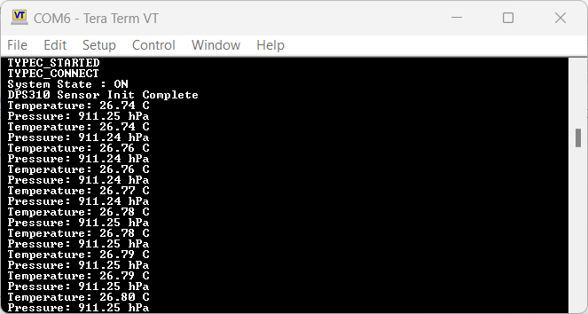
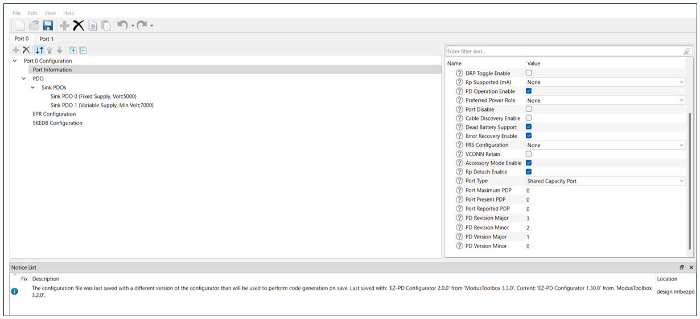
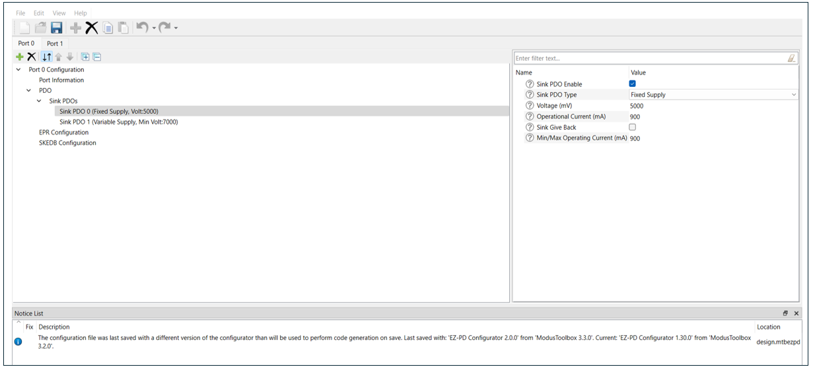

# EZ-PD&trade; PMG1 MCU: USBPD Sink DPS310 I2C sensor

This code example demonstrates USB Type-C attach detection and PD contract negotiation using EZ-PD&trade; PMG1 MCU devices. It also demonstrates how to integrate the DPS310 temperature and pressure sensor to PMG1 devices over the I2C interface.

The code uses the GPIO interrupt logic to detect button presses. Once the button is pressed and the system moves to the ON state, the firmware turns on the sink FET and user LED, and initializes the DPS310 sensor. The firmware then uses the TCPWM block in Timer/Counter mode to generate periodic interrupts to measures the sensor data. The measured temperature and pressure data are sent over UART to display on a terminal.

[View this README on GitHub.](https://github.com/Infineon/mtb-example-pmg1-usbpd-sink-dps310-i2c-sensor)

[Provide feedback on this code example.](https://cypress.co1.qualtrics.com/jfe/form/SV_1NTns53sK2yiljn?Q_EED=eyJVbmlxdWUgRG9jIElkIjoiQ0UyMzQxMzAiLCJTcGVjIE51bWJlciI6IjAwMi0zNDEzMCIsIkRvYyBUaXRsZSI6IkVaLVBEJnRyYWRlOyBQTUcxIE1DVTogVVNCUEQgU2luayBEUFMzMTAgSTJDIHNlbnNvciIsInJpZCI6InNvYmkiLCJEb2MgdmVyc2lvbiI6IjIuMS4wIiwiRG9jIExhbmd1YWdlIjoiRW5nbGlzaCIsIkRvYyBEaXZpc2lvbiI6Ik1DRCIsIkRvYyBCVSI6IldJUkVEIiwiRG9jIEZhbWlseSI6IlRZUEUtQyJ9)


## Requirements


- [ModusToolbox&trade;](https://www.infineon.com/modustoolbox) v3.3 or later (tested with v3.3)
- Board support package (BSP) minimum required version: 3.0.0
- Programming language: C
- Associated parts: All [EZ-PD&trade; PMG1 MCU](https://www.infineon.com/PMG1) parts


## Supported toolchains (make variable 'TOOLCHAIN')

- GNU Arm&reg; Embedded Compiler v11.3.1 (`GCC_ARM`) – Default value of `TOOLCHAIN`
- Arm&reg; Compiler v6.22 (`ARM`)
- IAR C/C++ Compiler v9.50.2 (`IAR`)


## Supported kits (make variable 'TARGET')


- [EZ-PD&trade; PMG1-S0 Prototyping Kit](https://www.infineon.com/CY7110) (`PMG1-CY7110`) - Default value of `TARGET`
- [EZ-PD&trade; PMG1-S1 Prototyping Kit](https://www.infineon.com/CY7111) (`PMG1-CY7111`)
- [EZ-PD&trade; PMG1-S2 Prototyping Kit](https://www.infineon.com/CY7112) (`PMG1-CY7112`)
- [EZ-PD&trade; PMG1-S3 Prototyping Kit](https://www.infineon.com/CY7113) (`PMG1-CY7113`)
- [EZ-PD&trade; PMG1-S1 Evaluation Kit](https://www.infineon.com/EVAL_PMG1_S1_DRP) (`EVAL_PMG1_S1_DRP`)
- [EZ-PD&trade; PMG1-S3 Evaluation Kit](https://www.infineon.com/EVAL_PMG1_S3_DUALDRP) (`EVAL_PMG1_S3_DUALDRP`)


## Hardware setup

1.	Connect the board to your PC using the USB cable through the KitProg3 USB connector. This cable is used for programming the PMG1 device and can be used during debugging.

2.	Connect the USBPD port to the USB-C power adapter or your PC using the USB Type-C cable. This cable is used as the USB power delivery source; it provides power to the PMG1 device for normal operation.

3.	Connect 3V3, GND, SCL, and SDA of the DPS310 Pressure Shield2Go module to the PMG1 Kit as follows:

      **Table 1. Pin connections: DPS310 and PMG1 Kit**

     DPS310 pin connection  | 3V3   | GND   | SCL   | SDA 
     :-----------------     | :---- | :---- | :---- | :-----
     PMG1-CY7110            | J6.1  | J6.14 | J7.12 | J7.11
     PMG1-CY7111            | J6.1  | J6.17 | J7.6  | J7.7
     PMG1-CY7112            | J6.1  | J6.17 | J7.6  | J7.7
     PMG1-CY7113            | J6.1  | J6.18 | J7.7  | J7.6
     EVAL_PMG1_S1_DRP       | J6.1  | J6.17 | J7.6  | J7.7
     EVAL_PMG1_S3_DUALDRP   | J6.1  | J6.3  | J6.14 | J6.15

4.	If UART DEBUG PRINT messages are enabled, UART connections are needed. Connect the UART Tx and UART Rx lines from the PMG1 kits to J3.8 and J3.10 on KitProg3 to establish a UART connection between KitProg3 and the PMG1 devices. See the kit user guide for more details on configuring the board.

      **Table 2. Connections: PMG1 Kit, UART Tx, and UART Rx**

     PMG1 kit UART connection          | UART Tx       | UART Rx
     :-----------------                | :------------ | :----------
     PMG1-CY7110 (revision 3 or lower) | J7.7 to J3.8  | J7.6 to J3.10
     PMG1-CY7111 (revision 2 or lower) | J6.10 to J3.8 | J6.9 to J3.10
     PMG1-CY7112 (revision 2 or lower) | J6.10 to J3.8 | J6.9 to J3.10
     PMG1-CY7113 (revision 3 or lower) | J6.10 to J3.8 | J6.9 to J3.10

      > **Note:** EVAL_PMG1_S1_DRP and EVAL_PMG1_S3_DUALDRP PMG1 kits have default UART connection with KitProg3.


## Software setup

See the [ModusToolbox&trade; tools package installation guide](https://www.infineon.com/ModusToolboxInstallguide) for information about installing and configuring the tools package.

Install a terminal emulator if you don't have one. Instructions in this document use [Tera Term](https://teratermproject.github.io/index-en.html).

If UART DEBUG PRINT messages are enabled, Tera term is used to view UART print messages.

This example requires no additional software or tools.


## Using the code example


### Create the project

The ModusToolbox&trade; tools package provides the Project Creator as both a GUI tool and a command line tool.

<details><summary><b>Use Project Creator GUI</b></summary>

1. Open the Project Creator GUI tool.

   There are several ways to do this, including launching it from the dashboard or from inside the Eclipse IDE. For more details, see the [Project Creator user guide](https://www.infineon.com/ModusToolboxProjectCreator) (locally available at *{ModusToolbox&trade; install directory}/tools_{version}/project-creator/docs/project-creator.pdf*).

2. On the **Choose Board Support Package (BSP)** page, select a kit supported by this code example. See [Supported kits](#supported-kits-make-variable-target).

   > **Note:** To use this code example for a kit not listed here, you may need to update the source files. If the kit does not have the required resources, the application may not work.

3. On the **Select Application** page:

   a. Select the **Applications(s) Root Path** and the **Target IDE**.

   > **Note:** Depending on how you open the Project Creator tool, these fields may be pre-selected for you.

   b.	Select this code example from the list by enabling its check box.

   > **Note:** You can narrow the list of displayed examples by typing in the filter box.

   c. (Optional) Change the suggested **New Application Name** and **New BSP Name**.

   d. Click **Create** to complete the application creation process.

</details>

<details><summary><b>Use Project Creator CLI</b></summary>

The 'project-creator-cli' tool can be used to create applications from a CLI terminal or from within batch files or shell scripts. This tool is available in the *{ModusToolbox&trade; install directory}/tools_{version}/project-creator/* directory.

Use a CLI terminal to invoke the 'project-creator-cli' tool. On Windows, use the command-line 'modus-shell' program provided in the ModusToolbox&trade; installation instead of a standard Windows command-line application. This shell provides access to all ModusToolbox&trade; tools. You can access it by typing "modus-shell" in the search box in the Windows menu. In Linux and macOS, you can use any terminal application.

The following example clones the "[USB PD Sink](https://github.com/Infineon/mtb-example-pmg1-usbpd-sink)" application with the desired name "UsbPdSink" configured for the *PMG1-CY7113* BSP into the specified working directory, *C:/mtb_projects*:

   ```
   project-creator-cli --board-id PMG1-CY7110 --app-id mtb-example-pmg1-usbpd-sink-dps310-i2c-sensor --user-app-name MyUSBPDSinkDPS310I2CSensor --target-dir "C:/mtb_projects"
   ```

The 'project-creator-cli' tool has the following arguments:

Argument | Description | Required/optional
---------|-------------|-----------
`--board-id` | Defined in the <id> field of the [BSP](https://github.com/Infineon?q=bsp-manifest&type=&language=&sort=) manifest | Required
`--app-id`   | Defined in the <id> field of the [CE](https://github.com/Infineon?q=ce-manifest&type=&language=&sort=) manifest | Required
`--target-dir`| Specify the directory in which the application is to be created if you prefer not to use the default current working directory | Optional
`--user-app-name`| Specify the name of the application if you prefer to have a name other than the example's default name | Optional

> **Note:** The project-creator-cli tool uses the `git clone` and `make getlibs` commands to fetch the repository and import the required libraries. For details, see the "Project creator tools" section of the [ModusToolbox&trade; tools package user guide](https://www.infineon.com/ModusToolboxUserGuide) (locally available at {ModusToolbox&trade; install directory}/docs_{version}/mtb_user_guide.pdf).

</details>


### Open the project

After the project has been created, you can open it in your preferred development environment.


<details><summary><b>Eclipse IDE</b></summary>

If you opened the Project Creator tool from the included Eclipse IDE, the project will open in Eclipse automatically.

For more details, see the [Eclipse IDE for ModusToolbox&trade; user guide](https://www.infineon.com/MTBEclipseIDEUserGuide) (locally available at *{ModusToolbox&trade; install directory}/docs_{version}/mt_ide_user_guide.pdf*).

</details>


<details><summary><b>Visual Studio (VS) Code</b></summary>

Launch VS Code manually, and then open the generated *{project-name}.code-workspace* file located in the project directory.

For more details, see the [Visual Studio Code for ModusToolbox&trade; user guide](https://www.infineon.com/MTBVSCodeUserGuide) (locally available at *{ModusToolbox&trade; install directory}/docs_{version}/mt_vscode_user_guide.pdf*).

</details>


<details><summary><b>Keil µVision</b></summary>

Double-click the generated *{project-name}.cprj* file to launch the Keil µVision IDE.

For more details, see the [Keil µVision for ModusToolbox&trade; user guide](https://www.infineon.com/MTBuVisionUserGuide) (locally available at *{ModusToolbox&trade; install directory}/docs_{version}/mt_uvision_user_guide.pdf*).

</details>


<details><summary><b>IAR Embedded Workbench</b></summary>

Open IAR Embedded Workbench manually, and create a new project. Then select the generated *{project-name}.ipcf* file located in the project directory.

For more details, see the [IAR Embedded Workbench for ModusToolbox&trade; user guide](https://www.infineon.com/MTBIARUserGuide) (locally available at *{ModusToolbox&trade; install directory}/docs_{version}/mt_iar_user_guide.pdf*).

</details>


<details><summary><b>Command line</b></summary>

If you prefer to use the CLI, open the appropriate terminal, and navigate to the project directory. On Windows, use the command-line 'modus-shell' program; on Linux and macOS, you can use any terminal application. From there, you can run various `make` commands.

For more details, see the [ModusToolbox&trade; tools package user guide](https://www.infineon.com/ModusToolboxUserGuide) (locally available at *{ModusToolbox&trade; install directory}/docs_{version}/mtb_user_guide.pdf*).

</details>


## Operation

1. Ensure that the steps listed in the [Hardware setup](#hardware-setup) section are completed.

2. Ensure that the jumper shunt on the power selection jumper (J5) is placed at 2-3 position while programming the kit.

3. Program the board using one of the following:

   <details><summary><b>Using Eclipse IDE</b></summary>

      1. Select the application project in the Project Explorer.

      2. In the **Quick Panel**, scroll down, and click **\<Application Name> Program (KitProg3_MiniProg4)**.
   </details>


   <details><summary><b>In other IDEs</b></summary>

   Follow the instructions in your preferred IDE.
   </details>


   <details><summary><b>Using CLI</b></summary>

     From the terminal, execute the `make program` command to build and program the application using the default toolchain to the default target. The default toolchain is specified in the application's Makefile but you can override this value manually:
      ```
      make program TOOLCHAIN=<toolchain>
      ```

      Example:
      ```
      make program TOOLCHAIN=GCC_ARM
      ```
   </details>

4. After programming the kit, change the position on the power selection jumper (J5) to 1-2 to power the kit through the USB PD port. Do not change the jumper (J5) position while the cables are connected to the power source.

5. Connect the USB cable back to the KitProg3 USB connector.

6. Open a terminal program and select the KitProg3 COM port. Set the serial port parameters to 8N1 and 115200 baud.

7. Connect the USB Type-C connector (J10) on the kit to a USBPD source device via a second USB Type-C to Type-C cable or a Type-C to Type-A cable. This will also power on the DPS310 module with 3.3 V on its 3v3 pin. Observe the red LED on the DPS310 Pressure shield2go module turn on, indicating that it is powered.

   The application will start printing debug messages such as Type-C events, Power Delivery contract details (Negotiated VBUS Voltage and VBUS Current).

8. Press the user switch (SW2) for two seconds to turn on the Sink FET and initialize the DPS310 sensor. The user LED (LED3) on the board turns on, indicating that the Sink FET is on.

   The application will start printing DPS310 initialization status and the measured sensor temperature and pressure data every two seconds.

9. Press the user switch (SW2) for two seconds to turn off the Sink FET and stop the DPS310 sensor measurement. The user LED (LED3) on the board will turn off to indicate that the Sink FET is off.

> **Note:** For the EVAL_PMG1_S3_DUALDRP Kit, DPS310 sensor display is applicable only for Port 0. In case of Port 1, it does not print any data. 


## Debugging

You can debug the example to step through the code.


<details><summary><b>In Eclipse IDE</b></summary>

Use the **\<Application Name> Debug (KitProg3_MiniProg4)** configuration in the **Quick Panel**. For details, see the "Program and debug" section in the [Eclipse IDE for ModusToolbox&trade; user guide](https://www.infineon.com/MTBEclipseIDEUserGuide).

Ensure that the board is connected to your PC using the USB cable through the KitProg3 USB connector and that the jumper shunt on the power selection jumper (J5) is placed at position 1-2. See the "Debug mode" section in the kit user guide.

For more details, see the "Program and debug" section in the [Eclipse IDE for ModusToolbox&trade; user guide](https://www.infineon.com/MTBEclipseIDEUserGuide).

</details>


<details><summary><b>In other IDEs</b></summary>

Follow the instructions in your preferred IDE.
</details>


## Design and implementation

EZ-PD&trade; PMG1 MCU devices support a USBPD block which integrates Type-C terminations, comparators, and the Power Delivery transceiver required to detect the attachment of a partner device and negotiate power contracts with it.

On reset, the USBPD block is initialized with the following settings:

   - The receiver clock input of the block is connected to a 12 MHz PERI-derived clock.

   - The transmitter clock input of the block is connected to a 600 kHz PERI-derived clock.

   - The SAR ADC clock input of the block is connected to a 1 MHz PERI-derived clock.

   - The SAR ADC in the USBPD block is configured to measure the VBUS_TYPE-C voltage through an internal divider.

This application uses the PDStack middleware library in an upstream facing port (UFP) - sink configuration. EZ-PD&trade; PMG1 MCUs have a dead-battery Rd termination, which ensures that a USB-C source/charger connected to it can detect the presence of a sink even when the EZ-PD&trade; PMG1 MCU is not powered.


**Figure 1. Firmware flowchart**


<br>

In addition to PDStack library initialization, the code also initializes the following blocks upon reset:

1.	The user button GPIO is configured to trigger an interrupt callback on both raising and falling edges. The code initializes a software timer to implement a 2 second debounce for button press.

2.	One of the SCB is initialized as UART to output debug messages and sensor data. To implement the UART data transfer on the SCB hardware block, the UART Peripheral Driver Library (PDL) APIs are used. The UART is initialized with the following settings:

	- **Baud rate:** 115200

	- **Data width:** 8 bits

	- **Parity:** None

	- **Stop bit:** 1

	- The clock input of the block is connected to a 12 MHz PERI-derived clock

3.	One of the SCBs is initialized as an I2C master to communicate with the DPS310 sensor. To implement the I2C master on the SCB hardware block, I2C PDL APIs are used. The I2C master peripheral is initialized with the following settings:

	- **Data rate:** 400 kbps

	- The clock input of the block is connected to a 12 MHz PERI-derived clock

4.	The TCPWM block is configured as a counter and is initialized to trigger an interrupt every two seconds. The firmware sets a flag to measure the DPS310 sensor data when the interrupt is triggered. The TCPWM peripheral is initialized with the following settings:

	- **Counter period:** 1999 (N-1)

	- Triggers interrupt upon overflow or underflow of the counter

	- The clock input to the block is connected to 12 MHz PERI-derived clock with divider setting for 1 kHz

The PDStack middleware library configures the USBPD block on the EZ-PD&trade; PMG1 MCU device to detect Type-C connection state changes and USB PD messages, and notify the stack through callback functions. The callback function registers the pending tasks, which are then handled by PDStack through the `Cy_PdStack_Dpm_Task` function. This function is expected to be called at appropriate times from the main processing loop of the application.

**Figure 2. PDStack task flowchart**


<br>

The PDStack middleware library implements the state machines defined in the [USB Type-C Cable and Connector](https://www.usb.org/document-library/usb-type-cr-cable-and-connector-specification-revision-20) and the [USB Power Delivery](https://www.usb.org/document-library/usb-power-delivery) specifications. PDStack consists of the following main modules:

- **Type-C Manager:** Responsible for detecting a Type-C connection and identifying the type of connection. It uses the configurable Rp/Rd terminations provided by the USBPD block and the internal line state comparators. The Type-C manager implements the state machines defined in **USB Type-C Cable and Connector specification** and provides the following functionalities:

    - **CC terminations management**: Applies Rp/Rd terminations according to the port role

    - **Attach detection**: Performs the required debounce and determines the type of device attached

    - **Detach detection**: Monitors the CC line and VBus for detecting a device detach

- **Protocol layer:** Forms the messages used to communicate between a pair of ports or cable plugs. It is responsible for forming capabilities messages, requests, responses, and acknowledgements. It receives inputs from the policy engine indicating which messages to send and relays the responses back to the policy engine.

- **Policy engine:** Provides a mechanism to monitor and control the USB Power Delivery system within a particular consumer, provider, or cable plug. It implements the state machines defined in the **USB Power Delivery** specification and contains the implementations of all PD atomic message sequences (AMS). It interfaces with the protocol layer for PD message transmission/reception for controlling the reception of message types according to conditions such as the current state of the port. It also interfaces with the Type-C manager for error conditions like Type-C error recovery.

- **Device policy manager (DPM):** Provides an interface to the application layer to initialize, monitor, and configure the PDStack middleware operation. It provides the following functionality:

    - Initializes the policy engine and Type-C manager

    - Starts the Type-C state machine followed by the policy engine state machine

    - Stops and disables the Type-C port

    - Allows entry or exit from Deep Sleep to achieve low power based on the port status

    - Provides APIs for the application to send PD or Type-C commands

    - Provides event callbacks to the application for application-specific handling

The PDStack library uses a set of callbacks registered by the application to perform board-specific tasks such as turning the consumer power path on or off and identifying the optimal source power profile to be used for charging. In this example, these functions are implemented using the appropriate APIs provided as part of the PDL.

The stack also provides notifications of various connection and PD policy state changes so the rest of the system can be configured as required. These events are used by the example application to implement a separate USB battery charging 1.2 sink state machine, which distinguishes between a standard downstream port (SDP), charging downstream port (CDP), and dedicated charging port (DCP).

In this application, the PMG1 device keeps the consumer power path off after the PD contract negotiation is complete. The application waits for the user to press the user switch (SW2) for 1.5 seconds to turn on/off the consumer path. When the consumer path is on, the user LED is on; the code initializes the DPS310 temperature and pressure sensor. Once the DPS310 initialization is complete, the firmware measures the temperature and pressure data every two seconds and sends it via UART to print the sensor-measured data on the serial terminal.

If the user button is pressed to turn off the consumer path, the DPS310 measurement is also stopped. Only the PDStack task continues to run, monitoring for any changes to the Type-C connection and PD messages.

**Figure 3. UART terminal with sensor data**




### Compile-time configurations

The PMG1 MCU USBPD Sink application functionality can be customized through a set of compile-time parameters that can be turned on/off through the *Makefile* file, *config.h*, or *main.c*.

**Table 3. Compile-time configurations**

 Macro name      | Description     | Allowed values
 :---------------| :-------------- | :-------------
 `CY_PD_SINK_ONLY`         | Specifies that the application supports only the USBPD Sink (consumer) role | 1u
 `NO_OF_TYPEC_PORTS`       | Specifies the number of USB-C ports supported | 1u
 `CY_PD_REV3_ENABLE`       | Enables USBPD Revision 3.0 support | 1u or 0u
 `BATTERY_CHARGING_ENABLE` | Enables BC 1.2 (CDP/DCP) detection when connected to a non-USBPD power source | 1u or 0u
 `SNK_STANDBY_FET_SHUTDOWN_ENABLE` | Specifies whether the consumer power path should be disabled while PD contracts are being negotiated | 1u or 0u
 `SYS_DEEPSLEEP_ENABLE` | Enables device entry into Deep Sleep mode for power saving when the CPU is idle | 1u or 0u
 `ENABLE_GPIO_INT_SECTION` | Enables user button press detection and controlling of the Sink FET based on the system state  | 1u or 0u
 `DEBUG_PRINT` | Debug print macro to enable UART print | 1u or 0u
 `ENABLE_DPS310_I2C_INTERFACE` | Enables all the application code required to handle the DPS310 sensor | 1u or 0u
 APP_FW_LED_ENABLE |Enables/disables firmware active LED operation | 1u or 0u

<br>


### PDStack library selection

The USB Type-C Connection Manager, USB PD protocol layer, and USB PD device policy engine state machine implementations are provided in the form of pre-compiled libraries as part of the PDStack middleware library.

Multiple variants of the PDStack library with different feature sets are provided; you can choose the appropriate version based on the features required by the target application.

   - **PMG1_PD3_SNK_LITE:** Library with support for USB Type-C sink operation and USB PD Revision 3.2 messaging. This library is chosen by default.

   - **PMG1_PD2_SNK_LITE:** Library with support for USB Type-C sink operation and USB PD Revision 2.0 messaging. Using this library reduces the flash (code) memory usage by the application.

   - **PMG1_PD3_SNK_EPR:** Library with support for USB Type-C sink EPR operation and USB PD Revision 3.2 messaging.

   - **PMG1_PD3_DRP:** Library with support for USB Type-C dual role operation and USB PD Revision 3.2 messaging.

Select the library of your choice by editing the *Makefile* file in the application folder and changing the value of the `COMPONENTS` variable. To use the PD Revision 2.0 library, replace the `PMG1_PD3_SNK_LITE` reference with `PMG1_PD2_SNK_LITE`.


### USB PD port configuration

The properties of the USB-C port, including the port role and the default response to various USB PD messages, can be configured using the EZ-PD&trade; Configurator Utility.

These parameters have been set to the appropriate values for a Power Delivery sink application by default. To view or change the configuration, click on the **EZ-PD&trade; Configurator 2.0** item under **Tools** in the **Quick Panel** to launch the configurator.

**Figure 4. USB Type-C port configuration using EZ-PD&trade;  Configurator**



<br>

Properties of the USB-C port are configured using the **Port Information** section. Because this application supports only the USB PD sink operation, you must set the **Port Role** as **Sink** and disable **DRP Toggle**. Set other parameters such as **Manufacturer Vendor ID** and **Manufacturer Product ID** to your desired values.


**Figure 5. Sink capability configuration using EZ-PD&trade; Configurator**



<br>

The power capabilities supported by the application in the sink role are specified using the **Sink PDO** section. See the [USB Power Delivery](https://www.usb.org/document-library/usb-power-delivery) specification for details on how to encode the various sink capabilities. A maximum of seven PDOs can be added using the configurator.

Once you have updated the parameters as desired, save the configuration and build the application.

For quick verification of the application configurability, disable the **PD Operation** parameter under **Port Information**. When the EZ-PD&trade; PMG1 MCU device is programmed with this modification, you can see that the user LED blinks at a slower rate even when connected to a power source which supports USB Power Delivery.


### Resources and settings

**Table 4. Application resources**

 Resource  |  Alias/object     |    Purpose
 :-------  | :------------  | :------------------------------------
 USBPD     	| PD_PORT0       	| USBPD block used for PD communication
 SCB			| I2C			 	| I2C block used for communication with the DPS310 sensor
 SCB			| UART			 	| UART block used to send debug message via terminal
 TCPWM			| CYBSP_TIMER	 	| Counter block used to trigger interrupt every 2 seconds for sensor data measurement
 LED (BSP) 	| CYBSP_USER_LED 	| User LED to indicate connection state
 SWITCH (BSP) 	| CYBSP_USER_BUTTON | User button to turn on/off the system state

<br>

**Table 5. List of application files and their usage**

 File                             | Purpose      
 :---------------------------     | :---------------------------
 *src/charger_detect.c* and *.h*  | Defines data structures, function prototypes and implements functions to handle BC 1.2 charger detection
 *src/i2c_master.c* and *.h*      | Defines data structures and function prototypes, and implements functions to perform I2C read and write to the DPS310 sensor
 *src/dps310.c* and *.h*          | Defines data structures and function prototypes, and implements functions to read and write various DPS310 registers, calculate temperature and pressure coefficients, configure sampling rates, and receive the measured temperature and pressure data from DPS310

<br>


## Related resources

Resources  | Links
-----------|----------------------------------
Application notes  | [AN232553](https://www.infineon.com/AN232553) – Getting started with EZ-PD&trade; PMG1 MCU on ModusToolbox&trade; <br>  [AN232565](https://www.infineon.com/an232565) – EZ-PD&trade; PMG1 MCU hardware design guidelines and checklist
Code examples  | [Using ModusToolbox&trade;](https://github.com/Infineon/Code-Examples-for-ModusToolbox-Software) on GitHub
Device documentation | [EZ-PD&trade; PMG1 MCU datasheets](https://www.infineon.com/PMG1DS)
Development kits | Select your kits from the [Evaluation Board Finder](https://www.infineon.com/cms/en/design-support/finder-selection-tools/product-finder/evaluation-board) page.
Libraries on GitHub | [mtb-pdl-cat2](https://github.com/Infineon/mtb-pdl-cat2) – Peripheral Driver Library (PDL) and documents
Middleware on GitHub  | [pdstack](https://github.com/Infineon/pdstack) – PDStack middleware library and documents <br> [pdutils](https://github.com/Infineon/pdutils) – PDUtils middleware library and documents <br> [pmg-app-common](https://github.com/Infineon/pmg-app-common) – PMG Application Common middleware library and documents
Tools  | [ModusToolbox&trade;](https://www.infineon.com/modustoolbox) – ModusToolbox&trade; software is a collection of easy-to-use libraries and tools enabling rapid development with Infineon MCUs for applications ranging from wireless and cloud-connected systems, edge AI/ML, embedded sense and control, to wired USB connectivity using PSOC&trade; Industrial/IoT MCUs, AIROC&trade; Wi-Fi and Bluetooth&reg; connectivity devices, XMC&trade; Industrial MCUs, and EZ-USB&trade;/EZ-PD&trade; wired connectivity controllers. ModusToolbox&trade; incorporates a comprehensive set of BSPs, HAL, libraries, configuration tools, and provides support for industry-standard IDEs to fast-track your embedded application development.

<br>


## Other resources

Infineon provides a wealth of data at [www.infineon.com](https://www.infineon.com) to help you select the right device, and quickly and effectively integrate it into your design.


## Document history

Document title: *CE234130* – *EZ-PD&trade; PMG1: USBPD sink DPS310 I2C sensor*

 Version | Description of change
 ------- | ---------------------
 1.0.0   | New code example
 1.1.0   | PD 2.0 compliance & build error fix
 2.0.0   | Major update to support ModusToolbox&trade; v3.0. This version is not backward compatible with previous versions of ModusToolbox&trade;
 2.1.0   | Updated to use the PmgAppCommon middleware
<br>


All referenced product or service names and trademarks are the property of their respective owners.

The Bluetooth&reg; word mark and logos are registered trademarks owned by Bluetooth SIG, Inc., and any use of such marks by Infineon is under license.


---------------------------------------------------------

© Cypress Semiconductor Corporation, 2020-2024. This document is the property of Cypress Semiconductor Corporation, an Infineon Technologies company, and its affiliates ("Cypress").  This document, including any software or firmware included or referenced in this document ("Software"), is owned by Cypress under the intellectual property laws and treaties of the United States and other countries worldwide.  Cypress reserves all rights under such laws and treaties and does not, except as specifically stated in this paragraph, grant any license under its patents, copyrights, trademarks, or other intellectual property rights.  If the Software is not accompanied by a license agreement and you do not otherwise have a written agreement with Cypress governing the use of the Software, then Cypress hereby grants you a personal, non-exclusive, nontransferable license (without the right to sublicense) (1) under its copyright rights in the Software (a) for Software provided in source code form, to modify and reproduce the Software solely for use with Cypress hardware products, only internally within your organization, and (b) to distribute the Software in binary code form externally to end users (either directly or indirectly through resellers and distributors), solely for use on Cypress hardware product units, and (2) under those claims of Cypress's patents that are infringed by the Software (as provided by Cypress, unmodified) to make, use, distribute, and import the Software solely for use with Cypress hardware products.  Any other use, reproduction, modification, translation, or compilation of the Software is prohibited.
<br>
TO THE EXTENT PERMITTED BY APPLICABLE LAW, CYPRESS MAKES NO WARRANTY OF ANY KIND, EXPRESS OR IMPLIED, WITH REGARD TO THIS DOCUMENT OR ANY SOFTWARE OR ACCOMPANYING HARDWARE, INCLUDING, BUT NOT LIMITED TO, THE IMPLIED WARRANTIES OF MERCHANTABILITY AND FITNESS FOR A PARTICULAR PURPOSE.  No computing device can be absolutely secure.  Therefore, despite security measures implemented in Cypress hardware or software products, Cypress shall have no liability arising out of any security breach, such as unauthorized access to or use of a Cypress product. CYPRESS DOES NOT REPRESENT, WARRANT, OR GUARANTEE THAT CYPRESS PRODUCTS, OR SYSTEMS CREATED USING CYPRESS PRODUCTS, WILL BE FREE FROM CORRUPTION, ATTACK, VIRUSES, INTERFERENCE, HACKING, DATA LOSS OR THEFT, OR OTHER SECURITY INTRUSION (collectively, "Security Breach").  Cypress disclaims any liability relating to any Security Breach, and you shall and hereby do release Cypress from any claim, damage, or other liability arising from any Security Breach.  In addition, the products described in these materials may contain design defects or errors known as errata which may cause the product to deviate from published specifications. To the extent permitted by applicable law, Cypress reserves the right to make changes to this document without further notice. Cypress does not assume any liability arising out of the application or use of any product or circuit described in this document. Any information provided in this document, including any sample design information or programming code, is provided only for reference purposes.  It is the responsibility of the user of this document to properly design, program, and test the functionality and safety of any application made of this information and any resulting product.  "High-Risk Device" means any device or system whose failure could cause personal injury, death, or property damage.  Examples of High-Risk Devices are weapons, nuclear installations, surgical implants, and other medical devices.  "Critical Component" means any component of a High-Risk Device whose failure to perform can be reasonably expected to cause, directly or indirectly, the failure of the High-Risk Device, or to affect its safety or effectiveness.  Cypress is not liable, in whole or in part, and you shall and hereby do release Cypress from any claim, damage, or other liability arising from any use of a Cypress product as a Critical Component in a High-Risk Device. You shall indemnify and hold Cypress, including its affiliates, and its directors, officers, employees, agents, distributors, and assigns harmless from and against all claims, costs, damages, and expenses, arising out of any claim, including claims for product liability, personal injury or death, or property damage arising from any use of a Cypress product as a Critical Component in a High-Risk Device. Cypress products are not intended or authorized for use as a Critical Component in any High-Risk Device except to the limited extent that (i) Cypress's published data sheet for the product explicitly states Cypress has qualified the product for use in a specific High-Risk Device, or (ii) Cypress has given you advance written authorization to use the product as a Critical Component in the specific High-Risk Device and you have signed a separate indemnification agreement.
<br>
Cypress, the Cypress logo, and combinations thereof, ModusToolbox, PSOC, CAPSENSE, EZ-USB, F-RAM, and TRAVEO are trademarks or registered trademarks of Cypress or a subsidiary of Cypress in the United States or in other countries. For a more complete list of Cypress trademarks, visit www.infineon.com. Other names and brands may be claimed as property of their respective owners.
